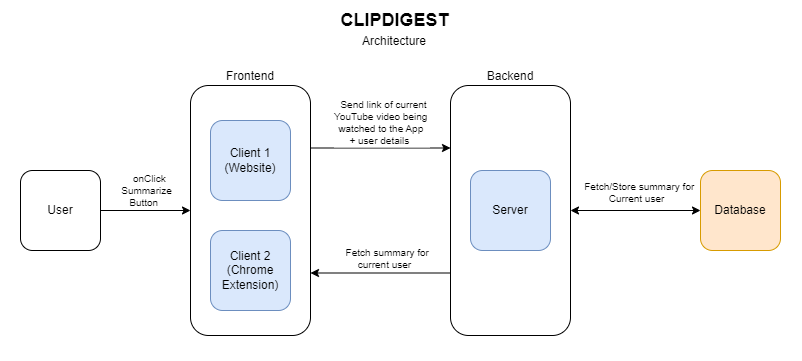
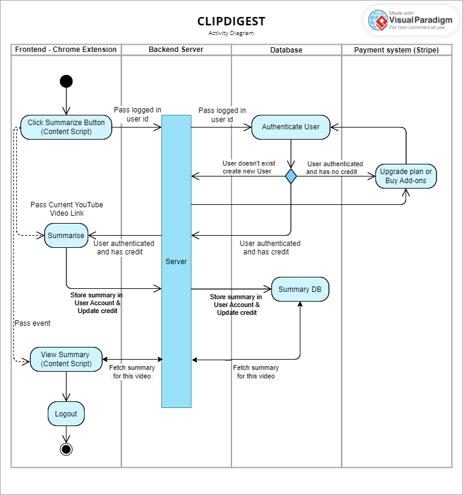

# CLIPDIGEST

### Table of Contents

1.  [App Architecture](#title1)
2.  [Tools, Technologies & Concepts](#title2)
3.  [Useful Tutorials](#title3)
4.  [Get the Code](#title4)
5.  [Configure, Build and Run the App](#title5)

---

# 1.) App Architecture <a id="title1"></a>





# 2.) Tools, Technologies & Concepts <a id="title2"></a>

-   [Chrome Developers Tools](https://developer.chrome.com/docs/extensions/)
-   [Webpack](https://webpack.js.org/)
-   [JSON Server](https://www.npmjs.com/package/json-server)
-   [ExpressJs](https://expressjs.com/)
-   [Web Components](https://developer.mozilla.org/en-US/docs/Web/Web_Components/Using_custom_elements)
-   [Shadow DOM](https://developer.mozilla.org/en-US/docs/Web/Web_Components/Using_shadow_DOM)
-   [React](https://reactjs.org/)
-   [React Router DOM](https://reactrouter.com/en/main)
-   [Material UI](https://mui.com/)
-   [Passport JS](http://www.passportjs.org/)

# 3.) Useful Tutorials <a id="title3"></a>

-   [Build a Chrome Extension With React & Webpack](https://www.youtube.com/watch?v=8OCEfOKzpAw)
-   [Getting Started with React Chrome Extensions (Manifest V3) Tutorial](https://www.youtube.com/watch?v=IV-CgmgJDBo)
-   [Hot Reload w/ React + Webpack Chrome Extensions (Manifest V3) Tutorial](https://www.youtube.com/watch?v=eN5eomaACDk)
-   [ReactJS Chrome Extension](https://youtube.com/playlist?list=PLBS1L3Ug2VVods9GnWbJc__STt9VnrJ9Z)
-   [Google OAuth2.0 using ReactJS Chrome Extension](https://youtube.com/playlist?list=PLBS1L3Ug2VVpgpDEcLmapOk52mVGv4MIu)
-   [MERN Stack Crash Course Tutorial](https://youtube.com/playlist?list=PL4cUxeGkcC9iJ_KkrkBZWZRHVwnzLIoUE)
-   [MERN Auth Tutorial](https://youtube.com/playlist?list=PL4cUxeGkcC9g8OhpOZxNdhXggFz2lOuCT)
-   [OAuth Login (Passport.js) Tutorial](https://youtube.com/playlist?list=PL4cUxeGkcC9jdm7QX143aMLAqyM-jTZ2x)
-   [Complete MongoDB Tutorial](https://youtube.com/playlist?list=PL4cUxeGkcC9h77dJ-QJlwGlZlTd4ecZOA)
-   [React JS Crash Course](https://www.youtube.com/watch?v=w7ejDZ8SWv8)
-   [MV3 Chrome Extension Development](https://youtube.com/playlist?list=PLEQgz7VhA7wBGMqRB4SqRSy48Vk7NxpcU)

# 4.) Get the Code <a id="title4"></a>

First, use git (through CLI or a client) to retrieve the code using git clone:

```
git clone https://github.com/malvibid/clip-digest-app.git
```

Next, because this repo uses [git submodules](https://git-scm.com/book/en/v2/Git-Tools-Submodules), you will need to pull the website, extension and server using:

```
git submodule update --init --recursive
```

# 5.) Configure, Build and Run the App <a id="title5"></a>

**Important**: Before proceeding you'll need to have a MongoDB cluster created.

This application is made of three parts:

-   Extension - Web UI that communicates with the API endpoints available through the Server. Takes the video URL from a YouTube video that is being currently watched and sends it to the ML model when the summarise button is clicked. Then this summary is POSTED to the database via the Server.
-   Website - Second Web UI, also communicates with the API endpoints to retrieve the users summaries and allows them to edit and save the Summaries.
-   Server - ExpressJS Server which uses the Mongoose library to connect to MongoDB

## a.) Configure the server

Configure the Server connection by adding an .env file to the project within the root clip-digest-server folder. Add the following environment variables:

```
WEBSITE_URL=http://localhost:/3000
PORT=<server_port>
MONGO_URI=<mongo_uri>
GOOGLE_CLIENT_ID=<google_client_id>
GOOGLE_CLIENT_SECRET=<google_client_secret>
```

**Note**: Replace the [GOOGLE_CLIENT_ID, GOOGLE_CLIENT_SECRET](https://youtu.be/fnz-gvWvw_w) and [MONGO_URI](https://youtu.be/tGciYnyQBE8) with your own values.

## b.) Install packages and run app

Open three terminals one for the server, one for the extension and one for the website. In the respective terminals, run the following commands to install the necessary packages and start the client/server.

In the server terminal:

```
cd clip-digest-server
npm install
npm run dev
```

In the extension terminal:

```
cd clip-digest-extension
npm install
npm run dev
```

In the website terminal:

```
cd clip-digest-website
npm install
npm start
```
